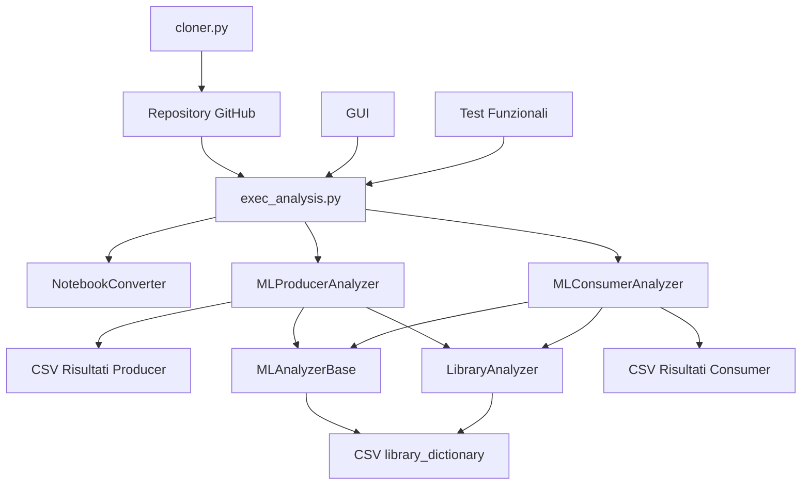

# Documentazione Completa di Reverse Engineering - MARK-Tool

## Indice

1. [Panoramica Generale del Sistema](#1-panoramica-generale-del-sistema)
2. [Architettura Completa e Interazioni](#2-architettura-completa-e-interazioni)
3. [Analisi Dettagliata dei Moduli Core](#3-analisi-dettagliata-dei-moduli-core)
4. [Algoritmi di Classificazione e Logica Interna](#4-algoritmi-di-classificazione-e-logica-interna)
5. [Sistema di Knowledge Base e Pattern Matching](#5-sistema-di-knowledge-base-e-pattern-matching)
6. [Modulo di Clonazione e Gestione Repository](#6-modulo-di-clonazione-e-gestione-repository)
7. [Interfaccia Grafica e Componenti UI](#7-interfaccia-grafica-e-componenti-ui)
8. [Sistema di Testing e Validazione Oracle](#8-sistema-di-testing-e-validazione-oracle)
9. [Struttura Dataset e Processo di Filtering](#9-struttura-dataset-e-processo-di-filtering)
10. [Flussi di Controllo e Orchestrazione](#10-flussi-di-controllo-e-orchestrazione)
11. [Gestione Errori e Robustezza](#11-gestione-errori-e-robustezza)
12. [Considerazioni di Performance e Scalabilità](#12-considerazioni-di-performance-e-scalabilità)
13. [Meccanismi di Estensibilità](#13-meccanismi-di-estensibilità)
14. [Appendice: Note e Limitazioni](#appendice-note-e-limitazioni)

---

## 1. Panoramica Generale del Sistema

### 1.1 Scopo e Obiettivi Architetturali

**MARK** (Machine learning Automated Rule-based Classification Kit) è un sistema di analisi statica progettato specificamente per classificare in modo automatico progetti di machine learning. L'architettura modulare del sistema si basa su una chiara separazione delle responsabilità:

- **Acquisizione dati**: Gestione di repository locali e remoti
- **Elaborazione**: Analisi statica del codice sorgente
- **Classificazione**: Applicazione di euristiche basate su knowledge base
- **Presentazione**: Interfaccia utente e generazione report

### 1.2 Principi Architetturali Fondamentali

#### Separazione delle Responsabilità
Una delle caratteristiche principali del sistema è la netta separazione tra i diversi livelli di responsabilità:
- **Logica di Business**: Algoritmi di classificazione (`MLProducerAnalyzer`, `MLConsumerAnalyzer`)
- **Gestione Dati**: Manipolazione CSV e knowledge base (`MLAnalyzerBase`)
- **Interfaccia Utente**: GUI desktop autonoma (`IGESAnalysisTool`)
- **Utilities**: Clonazione repository e conversione notebook

#### Pattern Template Method
La classe base astratta `MLAnalyzerBase` sfrutta il pattern Template Method per definire la struttura generale dell'algoritmo di analisi, lasciando alle sottoclassi la libertà di personalizzare i comportamenti specifici secondo le proprie esigenze.

#### Strategy Pattern
Per quanto riguarda le regole di classificazione (Rules 3 e 4), queste sono state pensate come strategie configurabili, il che significa che possono essere attivate o disattivate al volo in base alle necessità.

---

## 2. Architettura Completa e Interazioni

### 2.1 Struttura del progetto
Il processo di reverse engineering del software ha consentito di identificare diverse 
directory presenti all’interno del progetto. 
Tra queste, la directory di principale interesse è “MARK-Tool”, 
la quale contiene il codice sorgente, scritto in Python, del tool oggetto di analisi. 
Le restanti directory non risultano strettamente necessarie alla comprensione del 
funzionamento del software, in quanto non includono porzioni di 
codice ma prevalentemente file in formato CSV, che costituiscono 
la Knowledge Base del sistema. 
Per questo motivo, tali directory non verranno descritte in maniera approfondita nel presente documento.

#### Struttura generale
```
📁 .
├─ 📁 Dataset
├─ 📁 ExecutionOverview
├─ 🗎 LICENSE.md
├─ 📁 Libraries_API_Methods
├─ 📁 MARK-Configuration Study
├─ 📁 MARK-Tool
├─ 📁 ML Projects
├─ 🗎 README.MD
└─ 🗎 README.MD.docx
```
Di seguito vengono riportate sinteticamente le directory non centrali 
all’analisi, in quanto prive di codice sorgente:
- Dataset: presenta i dataset utilizzati per lo studio.
- ExecutionOverview: contiene documenti riguardo l'esecuzione e la Knowledge Base del tool.
- Libraries_API_Methods: contiene metodi e librerie utilizzati per la classificazione organizzati in files CSV .
- MARK-Configuration Study: presenta le configurazioni e i risultati di "Taxonomy-Ablation Study" del tool.
- ML Projects: contiene progetti ML e relative informazioni organizzati in file CSV.

#### Struttura del codice sorgente
Come precedentemente specificato, il codice sorgente del tool si trova
nella directory "MARK-Tool" la cui struttura interna è descritta
nell'albero sottostante:
```
📁 MARK-Tool
├─ 📁 MARK-Tool
│  ├─ 📁 Categorizer
│  ├─ 📁 Functional_Test
│  ├─ 🗎 LICENSE
│  ├─ 🗎 README.md
│  ├─ 🗎 __init__.py
│  └─ 📁 cloner
└─ 🗎 __init__.py
```

- **Categorizer**: Contiene la maggior parte del codice per l'analisi statica dei progetti. Strutturato come segue: 
```
📁 Categorizer
├─ 🗎 __init__.py
├─ 📁 oracle
├─ 📁 results
└─ 📁 src
   ├─ 📁 Consumers
   ├─ 📁 GUI
   ├─ 📁 Producers
   ├─ 🗎 __init__.py
   ├─ 🗎 analyzer_base.py
   ├─ 📁 components
   ├─ 🗎 consumer_classifier_by_dict.py
   ├─ 🗎 exec_analysis.py
   ├─ 📁 library_dictionary
   └─ 🗎 producer_classifier_by_dict.py
```
- **Functional_Test**: Contiene codice di test.
- **cloner**: Componenti per la clonazione di repository da GitHub.

### 2.2 Grafo delle Dipendenze



### 2.3 Flusso di Dati e Controllo

#### Fase di Inizializzazione
Durante la fase iniziale, il sistema compie alcune operazioni fondamentali:
1. **GUI Startup**: `IGESAnalysisTool` prepara e mostra l'interfaccia utente
2. **Path Validation**: Vengono verificati i percorsi di input e output per assicurarsi che siano validi
3. **Knowledge Base Loading**: I dizionari CSV contenenti le regole vengono caricati in memoria

#### Fase di Elaborazione
1. **Notebook Conversion**: `NotebookConverter` converte `.ipynb` in `.py`
2. **Repository Cloning**: `GitHubRepoCloner` (opzionale) scarica repository
3. **Analysis Orchestration**: `ExecAnalyzer` coordina l'analisi
4. **Static Analysis**: `LibraryAnalyzer` estrae import e pattern

#### Fase di Classificazione
1. **Producer Analysis**: `MLProducerAnalyzer` rileva pattern di training
2. **Consumer Analysis**: `MLConsumerAnalyzer` rileva pattern di inference
3. **Rule Application**: Applicazione delle regole configurabili
4. **Result Generation**: Creazione CSV di output strutturati

### 2.4 Gestione dello Stato e Persistenza

Lo stato del sistema viene mantenuto attraverso diversi meccanismi complementari:
- **File CSV**: Risultati persistenti e knowledge base
- **Memory State**: Dati temporanei durante l'elaborazione
- **GUI State**: Variabili tkinter per l'interfaccia
- **Configuration State**: Regole e parametri di analisi

---

## 3. Analisi Dettagliata dei Moduli Core

### 3.1 ExecAnalyzer - Orchestratore Principale

#### Responsabilità Architetturali
La classe `ExecAnalyzer` è l'**orchestratore principale** del sistema e coordina l'intero processo di analisi:

```python
class ExecAnalyzer:
    def __init__(self, input_path=None, output_path=None):
        script_dir = os.path.dirname(os.path.abspath(__file__))
        self.script_dir = script_dir
        self.input_path = input_path or os.path.join(script_dir, "..", "..", "repos")
        self.output_path = output_path or script_dir
```

#### Logica di Coordinamento
Il metodo `run()` è responsabile di orchestrare tutte le operazioni principali in una sequenza ben definita:

1. **Validazione Precondizioni**:
   - Verifica esistenza directory input
   - Validazione file knowledge base
   - Creazione directory output

2. **Analisi Produttori**:
   - Inizializzazione `MLProducerAnalyzer`
   - Configurazione path e dizionario
   - Esecuzione analisi su tutti i repository

3. **Analisi Consumatori**:
   - Inizializzazione `MLConsumerAnalyzer`
   - Applicazione regole 3 e 4 (hardcoded come `True`)
   - Elaborazione con filtri avanzati

#### Pattern di Gestione Errori
```python
if not os.path.exists(self.input_path):
    print(f"Error: The input folder '{self.input_path}' does not exist.")
    exit(1)
```

L'orchestratore adotta una filosofia **fail-fast**: quando si verifica un errore critico, l'esecuzione viene immediatamente interrotta piuttosto che continuare in uno stato inconsistente.

### 3.2 MLAnalyzerBase - Template Method Pattern

#### Design Pattern Implementato
La classe base astratta implementa il **Template Method Pattern**, definendo la struttura algoritmica comune:

```python
class MLAnalyzerBase(ABC):
    def __init__(self, output_folder, analysis_type):
        self.output_folder = output_folder
        self.analysis_type = analysis_type

    def init_analysis_folder(self):
        # Template method implementation
        analysis_path = os.path.join(self.output_folder, f"{self.analysis_type}_Analysis")
        if not os.path.exists(analysis_path):
            os.makedirs(analysis_path)
        
        # Dynamic filename generation based on analysis type
        if self.analysis_type.lower() == "producer":
            results_filename = 'results_first_step.csv'
        else:
            results_filename = 'results_consumer.csv'
        
        self.results_file = os.path.join(self.output_folder, results_filename)
```

#### Metodi di Utility Condivisi

**Costruzione Pattern Regex**:
```python
@staticmethod
def build_regex_pattern(keyword: str):
    keyword = re.escape(keyword)
    keyword = keyword.replace(r"\ ", r"\\s*")
    return re.compile(keyword, re.IGNORECASE)
```

Questo metodo esegue l'escape sicuro dei caratteri speciali e abilita la spaziatura flessibile solo se il pattern della Knowledge Base (KB) contiene esplicitamente una sequenza `\ ` (backslash + spazio). Nella KB corrente i pattern non includono spazi espliciti, quindi nella pratica si ottiene un matching robusto senza variazioni di spaziatura.

**Gestione Knowledge Base**:
```python
@staticmethod
def load_library_dict(input_file: str):
    return pd.read_csv(input_file, delimiter=",")
```

#### Controllo Duplicati e Backup
```python
def baseline_check(project: str, dir: str, df: pd.DataFrame):
    return f"{project}/{dir}" in df['ProjectName'].values
```

Per evitare di riprocessare inutilmente gli stessi progetti, il sistema effettua un controllo preventivo sui duplicati. Inoltre, prima di sovrascrivere qualsiasi risultato esistente, viene creato automaticamente un backup di sicurezza.

### 3.3 MLProducerAnalyzer - Rilevamento Pattern di Training

#### Algoritmo di Rilevamento Produttori

Il `MLProducerAnalyzer` specializza la classe base per rilevare pattern specifici dei produttori ML:

```python
def check_training_method(self, file, library_dict_path):
    producer_library_dict = self.load_library_dict(library_dict_path)
    list_keywords = []
    library_analyzer = LibraryAnalyzer(file)
    
    producer_related_dict = library_analyzer.check_ml_library_usage(producer_library_dict)
    producer_keywords = producer_related_dict['Keyword'].tolist()
    producer_library_dict_list = producer_related_dict['library'].tolist()
```

#### Logica di Pattern Matching

**Gestione Caratteri Speciali**:
```python
if '.' in str(keyword):
    keyword = keyword.replace('.', '\.')
if '\s' in str(keyword):
    parts = keyword.split()
    regex = r'\s*'.join(parts)  # Allows optional spaces between parts
    pattern = re.compile(regex, re.IGNORECASE)
else:
    if '(' in str(keyword):
        keyword = keyword.replace('(', '\(')
    pattern = re.compile(str(keyword), re.IGNORECASE)
```

L'implementazione gestisce diversi tipi di pattern:
- **Metodi**: come `.fit(` e `.train(`
- **Costruttori**: ad esempio `Model(`
- **Pattern con spazi**: gestiti in modo flessibile per catturare anche variazioni nella formattazione
    (nota: questo ramo si attiva solo se il pattern contiene realmente spazi o la sequenza `\s`; nella KB attuale non ve ne sono)

#### Struttura Dati di Output

Il sistema raccoglie evidenze dettagliate:
```python
found_result = {
    'keyword': keyword,
    'library': related_match['library'].values[0],
    'file': file,
    'line': line.strip(),
    'line_number': line_number
}
# Note: Nella versione finale, i risultati vengono aggregati in DataFrame con colonne:
# 'ProjectName', 'Is ML producer', 'libraries', 'where', 'keywords', 'line_number'
```

### 3.4 MLConsumerAnalyzer - Rilevamento Pattern di Inferenza

#### Implementazione Regola 3 (Rule 3)

La **Regola 3** è progettata per prevenire la "contaminazione" dei risultati ed evitare falsi positivi:

```python
def check_for_inference_method(self, file, consumer_library, producer_library, rules_3):
    # ... pattern matching logic ...
    if rules_3:
        if self.check_training_method(file, producer_library):
            flag = False  # Exclude if training patterns found
        else:
            flag = True   # Include only pure inference patterns
```

#### Implementazione Regola 4 (Rule 4)

La **Regola 4** filtra file non-produttivi:
```python
def analyze_project_for_consumers(self, repo_contents, project, in_dir, 
                                 consumer_library, producer_library, rules_3, rules_4):
    for file in files:
        if file.endswith(('.py', '.ipynb')):
            if rules_4 and re.search(r"test|example|eval|validat", file, re.IGNORECASE):
                continue  # Skip test/example files
```

Pattern esclusi:
- `test*`: File di test unitari
- `example*`: File di esempio/demo
- `eval*`: Script di valutazione
- `validat*`: Script di validazione

#### Logica di Classificazione Condizionale

```python
if re.search(pattern, line):
    if rules_3:
        if self.check_training_method(file, producer_library):
            flag = False
        else:
            flag = True
    else:
        flag = True
```

Questa logica consente di attivare o disattivare selettivamente le regole di filtraggio in base alle esigenze dell'analisi.

---

## 4. Algoritmi di Classificazione e Logica Interna

### 4.1 LibraryAnalyzer - Core dell'Analisi Statica

#### Algoritmo di Estrazione Import

```python
def get_libraries(self):
    libraries = []
    for line in lines:
        line = line.lstrip()  # Remove leading whitespace
        if 'import ' in line:
            if "from" in line:
                libraries.append(line.split(' ')[1])  # from X import Y -> X
            else:
                libraries.append(line.split(' ')[1])  # import X -> X
    return libraries
```

#### Normalizzazione Nomi Librerie

```python
for i in range(len(file_libraries)):
    if "." in file_libraries[i]:
        file_libraries[i] = file_libraries[i].split(".")[0]  # numpy.random -> numpy
    if is_consumer:
        file_libraries[i] = file_libraries[i].replace("\n", "")  # Clean newlines
```

#### Matching Knowledge Base

```python
def check_ml_library_usage(self, library_dict, is_consumer=False):
    file_libraries = self.get_libraries()
    # Normalize library names
    # Filter knowledge base by detected libraries
    dict_libraries = library_dict[library_dict['library'].isin(file_libraries)]
    return dict_libraries
```

### 4.2 Gestione Multi-Encoding

Il sistema gestisce file con encoding diversi. Questo è utile quando si analizzano progetti provenienti da contesti eterogenei:

```python
try:
    with open(self.file, "r", encoding="utf-8") as f:
        lines = f.readlines()
except UnicodeDecodeError:
    try:
        with open(self.file, "r", encoding="ISO-8859-1") as f:
            lines = f.readlines()
    except UnicodeDecodeError:
        print(f"Error reading file {self.file}")
        return libraries
```

### 4.3 Algoritmo di Raccolta Evidenze

#### Struttura Dati Evidenze

Per ogni pattern rilevato, il sistema raccoglie una serie di informazioni strutturate che fungono da "prove" della classificazione:

```python
found_result = {
    'keyword': keyword_clean,
    'library': related_match['library'].values[0],
    'file': file,
    'line': line.strip(),
    'line_number': line_number
}
```

#### Aggregazione e Persistenza

```python
df = pd.concat([
    df,
    pd.DataFrame({
        'ProjectName': f'{project}/{in_dir}',
        'Is ML consumer': 'Yes',
        'libraries': keyword['library'],
        'where': file_path,
        'keywords': keyword['keyword'],
        'line_number': keyword['line_number']
    }, index=[0])
], ignore_index=True)
# Il CSV finale include: ProjectName, Is ML consumer, libraries, where, keywords, line_number
```

---

## 5. Sistema di Knowledge Base e Pattern Matching

### 5.1 Struttura Knowledge Base Produttori

La knowledge base per i produttori è organizzata in un formato CSV strutturato:

```csv
library,Keyword,ML_Category,Link
tensorflow,.fit(,Producer,https://tensorflow.org/api_docs/
sklearn,.train(,Producer,https://scikit-learn.org/
pytorch,.backward(,Producer,https://pytorch.org/docs/
```

#### Categorie di Pattern Produttori

1. **Training Methods**: `.fit()`, `.train()`, `.compile()`
2. **Optimization**: `.backward()`, `.step()`, `.zero_grad()`
3. **Model Building**: `Sequential()`, `Model()`, `layers.Dense()`
4. **Data Preprocessing**: `.fit_transform()`, `.fit_generator()`

### 5.2 Struttura Knowledge Base Consumatori

```csv
library,Keyword,ML_Category,Link
tensorflow,.predict(,Consumer,https://tensorflow.org/api_docs/
sklearn,.predict(,Consumer,https://scikit-learn.org/
caffe,.forward(,Consumer,https://caffe.berkeleyvision.org/
```

#### Categorie di Pattern Consumatori

1. **Inference Methods**: `.predict()`, `.predict_proba()`, `.forward()`
2. **Model Loading**: `.load_model()`, `.load_weights()`
3. **Evaluation**: `.eval()`, `.evaluate()`, `.score()`
4. **Preprocessing**: `.transform()`, `.preprocess()`

### 5.3 Algoritmo di Pattern Matching

#### Compilazione Pattern Regex

```python
def build_regex_pattern(keyword: str):
    keyword = re.escape(keyword)  # Escape special regex characters
    keyword = keyword.replace(r"\ ", r"\\s*")  # Consenti spaziatura flessibile solo se indicata dal pattern
    return re.compile(keyword, re.IGNORECASE)
```

#### Gestione Casi Speciali

**Pattern con Parentesi**:
```python
if '(' in str(keyword):
    keyword = keyword.replace('(', '\(')
```

**Pattern con Punti**:
```python
if '.' in str(keyword):
    keyword = keyword.replace('.', '\.')
```

**Pattern con Spazi**:
```python
if '\\s' in str(keyword):  # Attivo solo se la KB contiene esplicitamente questa sequenza
    parts = keyword.split()
    regex = r'\\s*'.join(parts)
```

---

## 6. Modulo di Clonazione e Gestione Repository

### 6.1 GitHubRepoCloner - Architettura Concorrente

#### Design Pattern Thread Pool

```python
class GitHubRepoCloner:
    def start_search(self, iterable, max_workers=None):
        writer_lock = Lock()
        with concurrent.futures.ThreadPoolExecutor(max_workers=max_workers) as executor:
            for repo in iterable:
                _ = executor.submit(self.__search, repo, writer_lock)
```

#### Gestione Thread-Safe

```python
def __search(self, row, lock):
    try:
        Repo.clone_from(repo_url, clone_path, depth=1)
        print(f'cloned {repo_full_name}')
    except git.exc.GitError as e:
        with lock:  # Thread-safe error logging
            with open('errors.csv', 'a', encoding='utf-8') as error_log:
                error = e.__str__().replace("'", "").replace("\n", "")
                str = f"{repo_full_name},{repo_url},'{error}'"
                error_log.write(str + '\n')
```

### 6.2 Strategia di Clonazione Ottimizzata

#### Shallow Clone
```python
Repo.clone_from(repo_url, clone_path, depth=1)
```

Il sistema utilizza **shallow clone** con `depth=1` per minimizzare:
- Tempo di download
- Spazio su disco
- Carico di rete

#### Gestione Path Dinamici

```python
if self.no_repos2:
    clone_path = f'{self.output_path}/{repo_full_name}'
else:
    clone_path = f'{self.output_path}/repos2/{repo_full_name}'
```

### 6.3 Sistema di Logging e Recovery

#### Log Clonazioni Riuscite
```python
cloned_log = pd.read_csv('cloned_log.csv')
cloned_log = cloned_log.append(row, ignore_index=True)
cloned_log.to_csv('cloned_log.csv', index=False)
```

#### Prevenzione Duplicati
```python
if os.path.exists('cloned_log.csv'):
    cloned_log = pd.read_csv('cloned_log.csv', delimiter=",")
    df = df[~df['ProjectName'].isin(cloned_log['ProjectName'])]
```

---

## 7. Interfaccia Grafica e Componenti UI

### 7.1 IGESAnalysisTool - Architettura GUI

#### Pattern MVC (Model-View-Controller)

L'interfaccia grafica si ispira al pattern MVC, con una separazione pragmatica tra dati (variabili `StringVar`), vista (widget Tkinter/ttk) e controlli (callback), pur senza un'implementazione MVC formale:

```python
class IGESAnalysisTool:
    def __init__(self, root):
        self.root = root
        applica_stile(root)  # View styling
        self.root.title("IGES Analysis Tool")
        self.root.geometry("1000x600")
        
        # Model - Data binding
        self.input_var = tk.StringVar()
        self.output_var = tk.StringVar()
        self.github_var = tk.StringVar()
```

#### Architettura Tab-Based

```python
def _build_gui(self):
    self.tabs = ttk.Notebook(self.root)
    self.tabs.pack(fill="both", expand=True)
    self.tabs.bind("<Button-1>", self.close_tab_with_cross)
    
    self._build_tab_input()   # Input configuration tab
    self._build_tab_output()  # Results visualization tab
```

### 7.2 Sistema di Gestione Tab Dinamiche

#### Creazione Tab CSV

```python
def crea_tab_csv(self, percorso):
    # Check for existing tab
    for i in range(self.tabs.index("end")):
        if self.tabs.tab(i, "text") == tab_name:
            self.tabs.select(i)
            return
    
    # Create new tab with close button
    new_tab = ttk.Frame(self.tabs)
    self.tabs.add(new_tab, text=tab_name)
    self.tabs.select(new_tab)
```

#### Chiusura Tab Interattiva

```python
def close_tab_with_cross(self, event):
    x, y = event.x, event.y
    for index in range(self.tabs.index("end")):
        bbox = self.tabs.bbox(index)
        if x1 <= x <= x1 + width and y1 <= y <= y1 + height:
            if x >= close_x_start:  # Click on close button area
                self.tabs.forget(index)
                return
```

### 7.3 Sistema di Validazione Input

#### Validazione File CSV

```python
def esegui_script(self):
    if github_repo:
        if not github_repo.lower().endswith(".csv"):
            messagebox.showerror("Error", "The selected file is not a CSV file.")
            return
        
        try:
            with open(github_repo, newline='', encoding='utf-8') as f:
                reader = csv.reader(f)
                rows = list(reader)
                if len(rows) < 2:
                    messagebox.showerror("Error", "The CSV file is empty or contains only the header.")
                    return
```

Nota: il campo "GitHub Repo" accetta un file CSV contenente una colonna `ProjectName` con valori nel formato `owner/repo`. Se fornito, il tool clonerà tali repository prima di lanciare l'analisi.

### 7.4 Componenti di Visualizzazione Dati

#### TreeView per Risultati

```python
def _build_tab_output(self):
    self.tree_consumers = ttk.Treeview(frame_top, columns=["File"], show="headings", height=10)
    self.tree_consumers.heading("File", text="CSV File")
    
    # Hover effects
    self.tree_consumers.tag_configure("hover", background="#e0e0ff")
    self.tree_consumers.bind("<Motion>", self.on_motion_consumers)
    self.tree_consumers.bind("<Double-1>", lambda e: self.apri_da_tree(self.tree_consumers, "Consumers"))
```

#### Styling e Temi

```python
def applica_stile(root):
    root.style = ttk.Style(theme="flatly")
    root.configure(background=root.style.colors.bg)
    
    style = ttk.Style()
    style.configure("Treeview", font=("Consolas", 11), rowheight=26)
    style.configure("Treeview.Heading", font=("Consolas", 12, "bold"))
```

---

## 8. Sistema di Testing e Validazione Oracle

### 8.1 Merge - Validazione Ground Truth

#### Calcolo Metriche di Performance

```python
class Merge:
    def calc_performance_metrics(self, df):
        tp = self.calc_true_positives(df)
        fp = self.calc_false_positives(df)
        tn = self.calc_true_negatives(df)
        fn = self.calc_false_negatives(df)
        
        precision = tp / (tp + fp)
        recall = tp / (tp + fn)
        f1 = 2 * (precision * recall) / (precision + recall)
        accuracy = (tp + tn) / (tp + tn + fp + fn)
        
        return precision, recall, f1, accuracy
```

#### Matrice di Confusione

```python
def get_false_positives(self, df):
    return df[(df[f'Is_Real_ML_{self.column_name}'] == 'No') & 
              (df[f'Is_ML_{self.column_name}'] == 'Yes')]

def get_false_negatives(self, df):
    return df[(df[f'Is_Real_ML_{self.column_name}'] == 'Yes') & 
              (df[f'Is_ML_{self.column_name}'] == 'No')]
```

### 8.2 Oracle di Validazione

#### Struttura File Oracle

Gli oracle file contengono classificazioni manuali di ground truth:

```csv
ProjectName,Is_Real_ML_producer,Manual_Classification,Notes
project1/repo1,Yes,Verified,Contains sklearn training loops
project2/repo2,No,Verified,Only uses pre-trained models
```

#### Processo di Verifica

Il processo di verifica si articola in diverse fasi:

1. **Confronto Automatico**: I risultati prodotti dal tool vengono confrontati automaticamente con il ground truth
2. **Calcolo Metriche**: Vengono calcolate le metriche standard (Precision, Recall, F1-Score, Accuracy) per valutare l'accuratezza
3. **Analisi Errori**: Identificazione false positive/negative
4. **Report Dettagliato**: Breakdown per categoria e libreria

---

## 9. Struttura Dataset e Processo di Filtering

### 9.1 Organizzazione Dataset

#### Struttura Directory Dataset
```
Dataset/
├── Filtering Dataset/
│   ├── Baseline.csv          # Dataset originale non filtrato
│   ├── Baseline.xlsx         # Versione Excel del baseline
│   ├── Final_Dataset.csv     # Dataset finale filtrato
│   └── NicheValidation.xlsx  # Validazione su nicchie specifiche
```

#### Knowledge Base Libraries
```
Libraries_API_Methods/
├── Nguyen_Knowledge_Base/     # Knowledge base di riferimento
│   ├── Consumers_Nguyen_methods.csv
│   └── Producers_Nguyen_methods.csv
└── Our_Knowledge_Base/        # Knowledge base estesa
    ├── KB_Consumers.csv
    └── KB_Producers.csv
```

### 9.2 Processo di Filtering

#### Criteri di Filtraggio

1. **Filtraggio Linguaggio**: Solo progetti Python
2. **Filtraggio Dimensione**: Progetti con sufficiente codice sorgente
3. **Filtraggio Qualità**: Progetti con documentazione e struttura adeguate
4. **Filtraggio ML**: Progetti che effettivamente usano librerie ML

#### Pipeline di Validation

1. **Sampling Statistico**: Selezione campione rappresentativo
2. **Validazione Manuale**: Classificazione umana per ground truth
3. **Cross-Validation**: Verifica incrociata delle classificazioni
4. **Nicche Specializzate**: Validazione su domini specifici

---

## 10. Flussi di Controllo e Orchestrazione

### 10.1 Notebook Converter - Preprocessamento

#### Conversione .ipynb → .py

Il `NotebookConverter` scansiona una cartella target e invoca `jupyter nbconvert --to script` per ciascun `.ipynb`, generando i corrispondenti `.py`. Implementazione essenziale:

```python
class NotebookConverter:
    def __init__(self, folder_path="../../../repos/repos2/"):
        self.folder_path = folder_path

    def run(self):
        # Verifica l'esistenza della cartella e converte tutti i .ipynb in .py
        # tramite il comando di sistema "jupyter nbconvert --to script"
```

Note pratiche:
- È richiesto `jupyter nbconvert` installato e raggiungibile nel PATH.
- La cartella di default è relativa al file (`../../../repos/repos2/`); per usare la cartella di input scelta dall'utente, è necessario passare `folder_path` al costruttore.
- La conversione produce file `.py` ma non preserva metadata né output delle celle dei notebook.

### 10.2 Sequenza di Esecuzione Completa

#### Flusso Main Process

1. **Inizializzazione Sistema**
   ```python
   if __name__ == "__main__":
       converter = NotebookConverter()
       converter.run()  # Pre-processing
       
       analyzer = ExecAnalyzer(input_path=args.input_path, output_path=args.output_path)
       analyzer.run()  # Main analysis
   ```

2. **Pipeline di Analisi**
   ```
   Input Validation → 
   Notebook Conversion → 
   Producer Analysis → 
   Consumer Analysis → 
   Result Aggregation → 
   Output Generation
   ```

#### Gestione Stato Intermedio

Il sistema mantiene stato intermedio attraverso:
- File CSV di risultati parziali
- Log di progresso per recovery
- Backup automatici per sicurezza
- Checkpoint per elaborazioni lunghe

### 10.3 Gestione Configurazioni

#### Parametri di Configurazione

```python
# Regole di classificazione
rules_3 = True  # Anti-contamination rule
rules_4 = True  # File filtering rule

# Percorsi knowledge base
producer_dict_path = "library_dictionary/library_dict_producers_2.csv"
consumer_dict_path = "library_dictionary/library_dict_consumers_2.csv"
```

#### Configurazioni Dinamiche

Il sistema supporta:
- Versioni multiple di knowledge base
- Regole attivabili/disattivabili
- Parametri di threshold personalizzabili
- Output format configurabili

---

## 11. Gestione Errori e Robustezza

### 11.1 Strategie di Error Handling

#### Graceful Degradation

```python
try:
    with open(file, "r", encoding="utf-8") as f:
        lines = f.readlines()
except UnicodeDecodeError:
    try:
        with open(file, "r", encoding="ISO-8859-1") as f:
            lines = f.readlines()
    except UnicodeDecodeError:
        print(f"Error reading file {file}")
        return libraries  # Continua con lista vuota
```

#### Fail-Safe Mechanisms

- **Continue on Error**: L'analisi procede anche se singoli file falliscono
- **Partial Results**: Salvataggio risultati parziali per recovery
- **Error Logging**: Tracciamento dettagliato degli errori
- **Rollback Capability**: Possibilità di ripristino stato precedente

### 11.2 Validazione Input Robusta

#### Pre-conditions Checking

```python
if not os.path.exists(self.input_path):
    print(f"Error: The input folder '{self.input_path}' does not exist.")
    exit(1)

if not os.path.exists(producer_dict_path):
    print(f"Error Producer: The library dictionary '{producer_dict_path}' does not exist.")
    exit(1)
```

#### Runtime Validation

- Verifica formato file CSV
- Controllo integrità knowledge base
- Validazione struttura directory
- Monitoraggio risorse sistema

### 11.3 Recovery e Resilienza

#### Backup Strategy

```python
if not os.path.exists(self.results_file):
    # Create new results file
    df = pd.DataFrame(columns=[...])
    df.to_csv(self.results_file, index=False)
else:
    # Backup existing results
    df = pd.read_csv(self.results_file)
    backup_file = os.path.join(self.output_folder, f'results_backup_{int(time.time())}.csv')
    df.to_csv(backup_file, index=False)
```

#### Incremental Processing

Il sistema supporta elaborazione incrementale:
- Skip di progetti già elaborati
- Resume da interruzioni
- Update di risultati esistenti
- Merge di risultati multipli

---

## 12. Considerazioni di Performance e Scalabilità

### 12.1 Ottimizzazioni Performance

#### Memory Management

- **Streaming Processing**: Elaborazione file uno alla volta
- **Garbage Collection**: Liberazione esplicita memoria
- **Pandas Optimization**: Uso efficiente DataFrame
- **Regex**: Compilazione on‑demand dei pattern; possibile caching per keyword ripetute

#### I/O Optimization

```python
# Scritture incrementali su CSV
df = pd.concat([df, new_df], ignore_index=True)
df.to_csv(results_file, index=False)
```

### 12.2 Scalabilità Orizzontale

#### Thread Pool per Clonazione

```python
with concurrent.futures.ThreadPoolExecutor(max_workers=max_workers) as executor:
    for repo in iterable:
        _ = executor.submit(self.__search, repo, writer_lock)
```

#### Parallel Processing Potential

Il design modulare consente:
- Parallelizzazione analisi repository
- Distribuzione carico su multiple macchine
- Processing asincrono componenti
- Possibile distribuzione bilanciata del carico

### 12.3 Monitoring e Profiling

#### Performance Metrics

- Tempo elaborazione per repository
- Memoria utilizzata per analisi
- Throughput file processati
- Latenza operazioni I/O

#### Bottleneck Identification

Principali colli di bottiglia identificati:
1. **I/O File System**: Lettura file sorgente
2. **Regex Matching**: Pattern matching intensivo
3. **CSV Operations**: Manipolazione large datasets
4. **Git Operations**: Clonazione repository

---

## 13. Meccanismi di Estensibilità

### 13.1 Plugin Architecture Potential

#### Knowledge Base Extension

Il sistema supporta facilmente:
- Nuove librerie ML
- Pattern API aggiuntivi
- Regole di classificazione personalizzate
- Metriche di evaluation customizzate

#### Nuovo Analyzer Development

```python
class CustomAnalyzer(MLAnalyzerBase):
    def __init__(self, output_folder="Custom/"):
        super().__init__(output_folder, analysis_type="Custom")
        self.init_analysis_folder()
    
    def check_training_method(self, file, library_dict_path):
        # Custom implementation
        pass
```

### 13.2 Configuration-Driven Extensions

#### Rule Engine Expansion

```python
# Nuove regole configurabili
rules_config = {
    'rule_3': True,   # Existing anti-contamination
    'rule_4': True,   # Existing file filtering
    'rule_5': False,  # New: Domain-specific filtering
    'rule_6': False,  # New: Confidence threshold
}
```

#### Output Format Extensions

- JSON output support
- Database integration
- REST API endpoints
- Real-time streaming results

### 13.3 Future Enhancement Directions

#### Machine Learning Integration

- **Confidence Scoring**: ML models per confidence dei risultati
- **Pattern Learning**: Apprendimento automatico nuovi pattern
- **Anomaly Detection**: Identificazione progetti atipici
- **Recommendation System**: Suggerimenti miglioramento classificazione

#### Advanced Analytics

- **Trend Analysis**: Evoluzione temporale pattern ML
- **Ecosystem Mapping**: Visualizzazione relazioni librerie
- **Quality Metrics**: Metriche qualità progetti ML
- **Comparative Analysis**: Confronto framework e approach

---

## Conclusioni

In sintesi, MARK-Tool adotta un'architettura che combina i seguenti aspetti:

- **Interfaccia**: GUI con impostazioni essenziali e avvio analisi semplificato
- **Flessibilità**: Le configurazioni personalizzabili consentono di adattare il comportamento del sistema a diverse esigenze
- **Robustezza**: La gestione degli errori è stata curata nei dettagli, rendendo il sistema affidabile anche in situazioni problematiche
- **Estensibilità**: Il design modulare facilita l'aggiunta di nuove funzionalità senza stravolgere l'esistente
- **Performance**: Le ottimizzazioni implementate permettono di elaborare grandi volumi di dati in modo efficiente

L'implementazione applica principi comuni di ingegneria del software; i pattern architetturali sono stati selezionati in funzione del dominio dell'analisi statica del codice ML.

La separazione delle responsabilità, insieme all'uso di abstract base classes e a un approccio configuration-driven, rende MARK-Tool mantenibile ed estendibile. Queste caratteristiche lo rendono adatto a ulteriori evoluzioni e studi nel contesto del software engineering applicato al machine learning.

---

## Appendice: Note e Limitazioni

- Requisiti esterni: la conversione dei notebook richiede che `jupyter nbconvert` sia installato e nel PATH.
- Scope della conversione: di default i notebook vengono cercati in `../../../repos/repos2/` (relativo al modulo converter). Per usare la cartella scelta in GUI, passare `folder_path` a `NotebookConverter`.
- Pattern con spazi: i pattern nella KB attuale non contengono spazi; la logica `\s*` si applica solo a pattern che lo richiedono esplicitamente.
- Prestazioni regex: attualmente i regex sono compilati all'uso; un caching per keyword ricorrenti può migliorare performance su grandi codebase.
- Campo "GitHub Repo" in GUI: accetta un CSV con colonna `ProjectName` (formato `owner/repo`), non un singolo URL.

---

