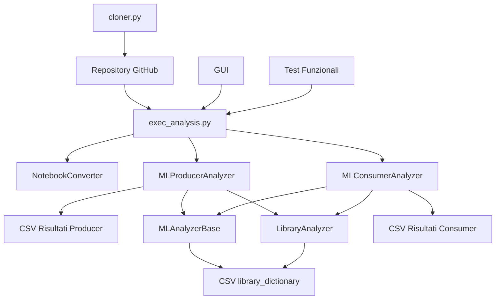

# Documentazione del Progetto MARK-Tool

## Indice
- [Panoramica del Progetto](#panoramica-del-progetto)
- [Struttura del Progetto e Componenti](#struttura-del-progetto-e-componenti)
- [Flusso di Controllo](#flusso-di-controllo)
- [Grafo delle Dipendenze](#grafo-delle-dipendenze)
- [Meccanismo di Funzionamento Base](#meccanismo-di-funzionamento-base)
- [Caratteristiche Principali](#caratteristiche-principali)
- [Scenari di Utilizzo](#scenari-di-utilizzo)
- [Installazione e Utilizzo](#installazione-e-utilizzo)
- [Dettagli dell'Implementazione Tecnica](#dettagli-dellimplementazione-tecnica)

## Panoramica del Progetto

**MARK** (Machine learning Automated Rule-based Classification Kit) è uno strumento di analisi statica pensato per classificare automaticamente i progetti di machine learning in due categorie principali:

- **Produttori di Modelli ML**: Progetti che si concentrano sulla creazione, addestramento e perfezionamento di modelli ML
- **Consumatori di Modelli ML**: Progetti che utilizzano modelli ML pre-addestrati per fare predizioni, analisi dati o integrare capacità ML nelle applicazioni

Lo strumento si basa su euristiche costruite partendo da una Base di Conoscenza di API ottenute da un dataset filtrato di progetti ML.

## Struttura del Progetto e Componenti

### Architettura Centrale
```
MARK-Tool/
├── Categorizer/                    # Motore principale di classificazione
│   ├── src/                       # Codice sorgente
│   │   ├── exec_analysis.py           # Punto di ingresso principale
│   │   ├── analyzer_base.py           # Classe base astratta
│   │   ├── producer_classifier_by_dict.py  # Analizzatore produttori
│   │   ├── consumer_classifier_by_dict.py  # Analizzatore consumatori
│   │   ├── components/               # Componenti di supporto
│   │   │   ├── static_analysis/      # Utility per analisi statica
│   │   │   │   └── library_extractor.py  # Rilevamento librerie
│   │   │   └── notebook_converter.py # Gestione notebook Jupyter
│   │   ├── library_dictionary/       # Base di conoscenza
│   │   │   ├── library_dict_producers_1.csv
│   │   │   ├── library_dict_producers_2.csv
│   │   │   ├── library_dict_consumers_1.csv
│   │   │   └── library_dict_consumers_2.csv
│   │   └── GUI/                     # Interfaccia grafica
│   │       ├── gui_analysis.py
│   │       └── style_gui.py
│   ├── oracle/                    # Dati di validazione ground truth
│   │   ├── oracle_consumer.csv
│   │   ├── oracle_producer.csv
│   │   └── result_analysis/
│   └── results/                   # Risultati output
│       ├── consumer.csv
│       └── producer.csv
├── cloner/                        # Utility per clonazione repository
│   ├── cloner.py
│   ├── cloning_check.py
│   ├── applied_projects.csv
│   └── selected_projects.csv
└── Functional_Test/               # Suite di test
    ├── cloner_test/
    └── exec_analysis_test/
```

### Descrizione dei Componenti Chiave

#### 1. **exec_analysis.py** - Punto di Ingresso Principale
- Orchestrea l'intera pipeline di analisi
- Gestisce gli argomenti da riga di comando
- Coordina le fasi di analisi dei produttori e consumatori
- Gestisce la conversione dei notebook e la risoluzione dei percorsi

#### 2. **analyzer_base.py** - Classe Base Astratta
- Definisce le funzionalità comuni per entrambi gli analizzatori
- Gestisce le operazioni sui file e la gestione CSV
- Fornisce metodi di utilità per la costruzione di pattern regex
- Gestisce l'inizializzazione delle cartelle di output

#### 3. **producer_classifier_by_dict.py** - Analisi Produttori
- Implementa la logica di rilevamento per i produttori ML
- Cerca pattern API relativi all'addestramento
- Utilizza la base di conoscenza specifica per i produttori
- Genera i risultati di classificazione per i produttori

#### 4. **consumer_classifier_by_dict.py** - Analisi Consumatori
- Implementa la logica di rilevamento per i consumatori ML
- Cerca pattern API relativi all'inferenza
- Implementa regole di rilevamento configurabili (Regole 3 e 4)
- Utilizza la base di conoscenza specifica per i consumatori

#### 5. **library_extractor.py** - Nucleo dell'Analisi Statica
- Estrae le dichiarazioni import dai file Python
- Confronta le librerie importate con la base di conoscenza
- Gestisce diversi formati di codifica
- Fornisce analisi dell'utilizzo delle librerie

## Flusso di Controllo

### 1. Esecuzione del Punto di Ingresso Principale
```bash
python exec_analysis.py --input_path /percorso/ai/repository --output_path /percorso/di/output
```

### 2. Processo di Inizializzazione
```
1. NotebookConverter.run()
   ├── Converte file .ipynb in file .py
   └── Prepara i file per l'analisi statica

2. Validazione Percorsi
   ├── Verifica che la directory di input esista
   ├── Crea le directory di output
   └── Verifica che i file della base di conoscenza esistano

3. Caricamento Base di Conoscenza
   ├── Carica il dizionario produttori (library_dict_producers_2.csv)
   └── Carica il dizionario consumatori (library_dict_consumers_2.csv)
```

### 3. Pipeline di Analisi in Due Fasi

#### Fase 1: Analisi Produttori
```
Inizializzazione MLProducerAnalyzer
├── Crea cartella output: Producers/Producers_Final/
├── Carica base di conoscenza produttori
├── Per ogni repository del progetto:
│   ├── Scansiona tutti i file .py e .ipynb
│   ├── Estrae gli import delle librerie
│   ├── Confronta con i pattern dei produttori
│   ├── Registra chiamate API relative all'addestramento
│   └── Genera classificazione produttore
└── Salva risultati in results_first_step.csv
```

#### Fase 2: Analisi Consumatori
```
Inizializzazione MLConsumerAnalyzer
├── Crea cartella output: Consumers/Consumers_Final/
├── Carica basi di conoscenza consumatori e produttori
├── Applica regole di rilevamento (Regole 3 e 4 abilitate)
├── Per ogni repository del progetto:
│   ├── Filtra file basandosi sulla Regola 4 (esclude file test/esempio)
│   ├── Scansiona i rimanenti file .py e .ipynb
│   ├── Controlla pattern di inferenza (Regola 3)
│   ├── Confronta con i pattern dei consumatori
│   ├── Registra chiamate API relative all'inferenza
│   └── Genera classificazione consumatore
└── Salva risultati in results_consumer.csv
```

## Grafo delle Dipendenze



### Dipendenze Esterne
- **pandas**: Manipolazione dati e gestione CSV
- **git**: Funzionalità di clonazione repository
- **re**: Matching di pattern con espressioni regolari
- **os**: Operazioni sul file system
- **argparse**: Parsing argomenti da riga di comando
- **logging**: Debug e logging degli errori
- **concurrent.futures**: Elaborazione parallela per la clonazione

## Meccanismo di Funzionamento Base

### 1. Approccio Basato su Base di Conoscenza

Lo strumento si affida a basi di conoscenza curate che contengono:

#### Struttura Base di Conoscenza Produttori
```csv
library,Keyword,ML_Category,Link
accelerate,Accelerator(,Producer,https://huggingface.co/docs/accelerate/basic_tutorials/migration
tensorflow,.fit(,Producer,https://tensorflow.org/api_docs/
sklearn,.train(,Producer,https://scikit-learn.org/
pytorch,.backward(,Producer,https://pytorch.org/docs/
```

#### Struttura Base di Conoscenza Consumatori
```csv
library,Keyword,ML_Category,Link
tensorflow,.predict(,Consumer,https://tensorflow.org/api_docs/
sklearn,.predict(,Consumer,https://scikit-learn.org/
caffe,.forward(,Consumer,https://caffe.berkeleyvision.org/
imageai,.classifyImage(,Consumer,https://imageai.readthedocs.io/
```

### 2. Processo di Analisi Statica del Codice

#### Algoritmo di Rilevamento Librerie
1. **Lettura File**: Apre i file Python con codifica UTF-8 (fallback a ISO-8859-1)
2. **Estrazione Import**: Analizza le dichiarazioni import usando pattern regex
3. **Normalizzazione Librerie**: Estrae i nomi base delle librerie (rimuove i sottomoduli)
4. **Matching Base di Conoscenza**: Confronta con i dizionari curati

#### Processo di Matching Pattern
1. **Ricerca Parole Chiave**: Cerca chiamate specifiche di metodi API
2. **Compilazione Regex**: Costruisce pattern case-insensitive con gestione spazi
3. **Analisi Riga per Riga**: Scansiona ogni riga per trovare corrispondenze di pattern
4. **Registrazione Contesto**: Cattura percorso file, numero riga e parola chiave trovata

### 3. Sistema di Classificazione Basato su Regole

#### Regola 3: Rilevamento Avanzato Consumatori
- **Scopo**: Filtrare attività relative all'addestramento nell'analisi dei consumatori
- **Implementazione**: Controlla i pattern dei produttori prima di classificare come consumatore
- **Logica**: Se vengono trovati pattern di addestramento, esclude dalla classificazione come consumatore puro

#### Regola 4: Filtraggio File
- **Scopo**: Escludere codice non-produttivo dall'analisi
- **Pattern**: `test|example|eval|validat` (case-insensitive)
- **File Esclusi**: Test unitari, esempi, script di valutazione, codice di validazione
- **Razionale**: Concentrarsi sull'uso ML effettivo in produzione

### 4. Generazione Output

#### Struttura Risultati
```csv
ProjectName,Is ML producer/consumer,libraries,where,keywords,line_number
project1/repo1,Yes,tensorflow,/percorso/al/file.py,model.fit(,45
project2/repo2,Yes,sklearn,/percorso/allo/script.py,.predict(,123
```

#### Report di Analisi
- **Report Panoramica**: Riassunto di classificazione ad alto livello
- **Report Dettagliato**: Evidenze complete con posizioni dei file
- **Tracciamento Evidenze**: Chiamate API specifiche e numeri di riga
- **Indicatori di Confidenza**: Numero di corrispondenze e forza del pattern

## Caratteristiche Principali

### 1. Classificazione Automatizzata
- **Zero Intervento Manuale**: Pipeline di analisi completamente automatizzata
- **Elaborazione Scalabile**: Gestisce centinaia di repository in modo efficiente
- **Criteri Consistenti**: Standard di classificazione uniformi attraverso i progetti
- **Elaborazione Batch**: Analizza progetti multipli simultaneamente

### 2. Risultati Basati su Evidenze
- **Evidenze Tracciabili**: Chiamate API specifiche come prova di classificazione
- **Posizione Sorgente**: Percorsi dei file e numeri di riga esatti
- **Link Documentazione**: Riferimenti alla documentazione API ufficiale
- **Forza Pattern**: Punti di evidenza multipli aumentano la confidenza

### 3. Analisi Configurabile
- **Toggle delle Regole**: Abilita/disabilita regole di rilevamento specifiche
- **Versioni Base di Conoscenza**: Configurazioni multiple di dizionari
- **Personalizzazione Output**: Formattazione flessibile dei risultati
- **Configurazione Percorsi**: Directory di input/output personalizzabili

### 4. Supporto Multi-Formato
- **File Python**: Analisi nativa di file .py
- **Notebook Jupyter**: Conversione automatica da .ipynb a .py
- **Flessibilità Codifica**: Supporto per codifiche di caratteri multiple
- **Parsing Import**: Analisi comprensiva delle dichiarazioni import

### 5. Gestione Robusta degli Errori
- **Errori di Accesso File**: Gestione elegante di problemi di permessi
- **Problemi di Codifica**: Strategie di fallback per la codifica
- **Dipendenze Mancanti**: Messaggi di errore chiari e validazione
- **Risoluzione Percorsi**: Gestione di percorsi assoluti per affidabilità

## Scenari di Utilizzo

### 1. Ricerca Accademica
- **Studi Ecosistema ML**: Analizzare pattern di adozione ML
- **Popolarità Framework**: Tracciare trend di utilizzo delle librerie
- **Classificazione Progetti**: Categorizzare grandi dataset di ricerca
- **Analisi Comparative**: Confrontare rapporti produttore vs consumatore

### 2. Applicazioni Industriali
- **Auditing Codice**: Comprendere l'utilizzo ML nei codebase aziendali
- **Analisi Dipendenze**: Identificare dipendenze dei framework ML
- **Pianificazione Migrazione**: Valutare sforzo per aggiornamenti framework ML
- **Controllo Conformità**: Verificare utilizzo ML contro le politiche

### 3. Analisi Open Source
- **Mining GitHub**: Classificare progetti ML open source
- **Trend Community**: Analizzare pattern di sviluppo ML
- **Adozione Librerie**: Tracciare uptake di nuovi framework
- **Valutazione Qualità**: Identificare progetti ML ben strutturati

### 4. Scopi Educativi
- **Materiale Didattico**: Dimostrare classificazione di progetti ML
- **Progetti Studenti**: Analizzare implementazioni ML accademiche
- **Best Practice**: Identificare pattern di codifica ML esemplari
- **Sviluppo Curriculum**: Comprendere utilizzo ML degli studenti

## Installazione e Utilizzo

### Prerequisiti
```bash
pip install pandas git-python
```

### Utilizzo Base
```bash
# Esegui analisi con impostazioni predefinite
python exec_analysis.py

# Specifica percorsi di input e output personalizzati
python exec_analysis.py --input_path /percorso/ai/repository --output_path /percorso/ai/risultati

# Utilizzare l'interfaccia GUI
python GUI/gui_analysis.py
```

### Clonazione Repository
```bash
# Clona repository per l'analisi
python cloner/cloner.py --input selected_projects.csv --output ./repos/
```

### Struttura Output Attesa
```
percorso_output/
├── Producers/
│   └── Producers_Final/
│       ├── results_first_step.csv
│       └── individual_project_results/
└── Consumers/
    └── Consumers_Final/
        ├── results_consumer.csv
        └── individual_project_results/
```

## Dettagli dell'Implementazione Tecnica

### Classi e Metodi Centrali

#### MLAnalyzerBase (Classe Base Astratta)
```python
class MLAnalyzerBase(ABC):
    def __init__(self, output_folder, analysis_type)
    def init_analysis_folder(self)
    @staticmethod
    def build_regex_pattern(keyword: str)
    @staticmethod
    def load_library_dict(input_file: str)
    @abstractmethod
    def check_training_method(self, file: str, library_dict_path: str)
```

#### MLProducerAnalyzer
```python
class MLProducerAnalyzer(MLAnalyzerBase):
    def check_training_method(self, file, library_dict_path)
    def analyze_projects_set_for_producers(self, input_path, producer_dict_path)
```

#### MLConsumerAnalyzer
```python
class MLConsumerAnalyzer(MLAnalyzerBase):
    def check_training_method(self, file, producer_library)
    def check_for_inference_method(self, file, consumer_library, producer_library, rules_3)
    def analyze_projects_set_for_consumers(self, input_path, consumer_library, producer_library, rules_3, rules_4)
```

#### LibraryAnalyzer
```python
class LibraryAnalyzer:
    def __init__(self, file_path)
    def get_libraries(self)
    def check_ml_library_usage(self, library_dict, is_consumer=False)
```

### Considerazioni sulle Prestazioni

- **Gestione Memoria**: Elabora i file individualmente per minimizzare l'uso della memoria
- **Elaborazione Parallela**: Clonazione concorrente di repository per efficienza
- **Ottimizzazione Regex**: Pattern compilati per matching più veloce
- **Filtraggio File**: Esclusione precoce di file irrilevanti

### Strategie di Gestione Errori

- **Degradazione Elegante**: Continua l'analisi anche se alcuni file falliscono
- **Logging Comprensivo**: Reporting dettagliato degli errori per debugging
- **Validazione Input**: Verifica percorsi e file prima dell'elaborazione
- **Creazione Backup**: Preserva risultati esistenti prima di sovrascrivere
